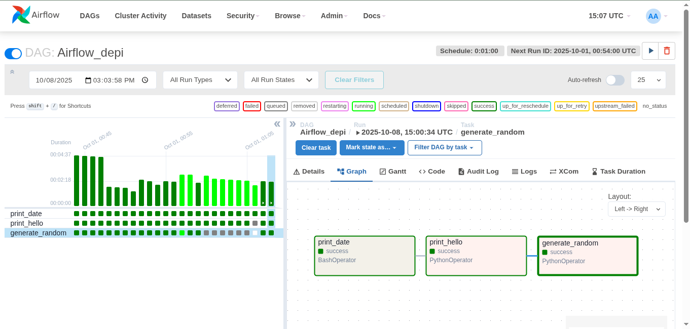
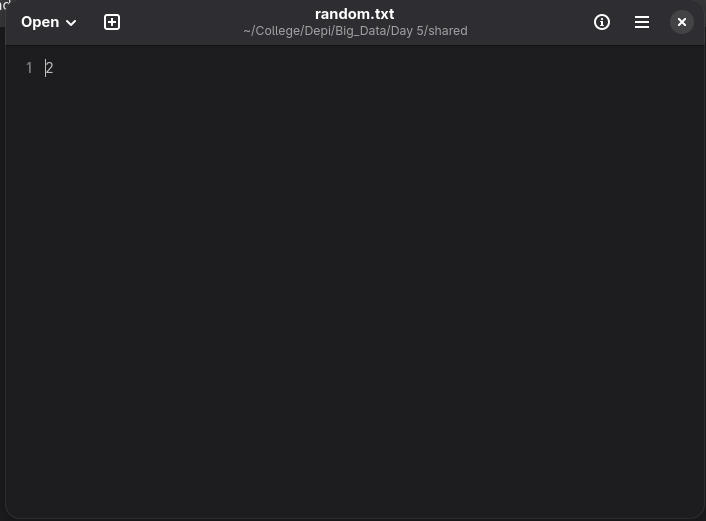

# Airflow basic dag

## Steps to work it out

1- Write the dag script.
2- Run the docker compose file by using `docker compose up -d`.
3- Open airflow webserver on `localhost:8080`.
4- Open `random.txt`inside of shared folder to see the random number being generated.

## The DAG is working 

## Random text file

